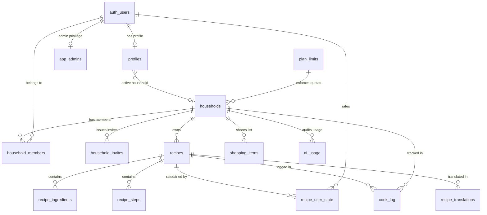

# Cookaloo – Data Model & Security Architecture (DATA_MODEL.md)

This document specifies the PostgreSQL relational schema, indexes, security constraints, stored procedures (RPCs), and complete Row-Level Security (RLS) policies for Supabase.

---

## 1. Entity-Relationship Overview



---

## 2. Table Definitions & DDL

```sql
-- Enable necessary extensions
create extension if not exists "uuid-ossp";

-- ============================================================================
-- 1. SYSTEM PLANS & APP ADMINS
-- ============================================================================

-- Plan definitions and quotas (mirrors config/plans.ts)
create table public.plan_limits (
  plan text primary key check (plan in ('free', 'premium')),
  max_recipes int not null,
  max_members int not null,
  ai_imports_per_month int not null,
  max_owned_households int not null default 3,
  can_translate boolean not null default false
);

insert into public.plan_limits (plan, max_recipes, max_members, ai_imports_per_month, max_owned_households, can_translate) values
  ('free', 50, 2, 10, 3, false),
  ('premium', 1000000, 6, 100, 10, true);

-- App Administrators (Owner-only table, managed strictly via Supabase dashboard / SQL)
create table public.app_admins (
  user_id uuid primary key references auth.users(id) on delete cascade,
  created_at timestamptz not null default now()
);

-- ============================================================================
-- 2. HOUSEHOLDS, MEMBERS & INVITES
-- ============================================================================

create table public.households (
  id uuid primary key default gen_random_uuid(),
  name text not null,                                   -- e.g. "Familjen Baard"
  plan text not null default 'free' check (plan in ('free', 'premium')),
  created_by uuid references auth.users(id) on delete set null,
  created_at timestamptz not null default now(),
  updated_at timestamptz not null default now()
);

create table public.household_members (
  id uuid primary key default gen_random_uuid(),
  household_id uuid references public.households(id) on delete cascade not null,
  user_id uuid references auth.users(id) on delete cascade not null,
  role text not null default 'member' check (role in ('owner', 'member')),
  joined_at timestamptz not null default now(),
  unique (household_id, user_id)
);

create table public.household_invites (
  id uuid primary key default gen_random_uuid(),
  household_id uuid references public.households(id) on delete cascade not null,
  code text unique not null,                            -- generated securely server-side
  email text,                                           -- optional target invitee
  created_by uuid references auth.users(id) on delete cascade not null,
  created_at timestamptz not null default now(),
  expires_at timestamptz not null default (now() + interval '7 days'),
  used_at timestamptz,
  used_by uuid references auth.users(id) on delete set null
);

-- ============================================================================
-- 3. USER PROFILES
-- ============================================================================

create table public.profiles (
  user_id uuid primary key references auth.users(id) on delete cascade,
  display_name text,
  ui_language text not null default 'sv' check (ui_language in ('sv', 'en')),
  unit_system text not null default 'metric' check (unit_system in ('metric', 'us')),
  active_household_id uuid references public.households(id) on delete set null,
  created_at timestamptz not null default now(),
  updated_at timestamptz not null default now()
);

-- ============================================================================
-- 4. RECIPES, INGREDIENTS & STEPS
-- ============================================================================

create table public.recipes (
  id uuid primary key default gen_random_uuid(),
  household_id uuid references public.households(id) on delete cascade not null,
  title text not null,
  description text,
  image_url text,                                       -- signed storage path or external URL
  servings int not null default 4 check (servings > 0), -- original source servings; UI default is 4
  servings_estimated boolean not null default false,
  prep_time_minutes int check (prep_time_minutes >= 0),
  cook_time_minutes int check (cook_time_minutes >= 0),
  source_url text,
  source_name text,                                     -- e.g. "smakrikt.se", ICA, Arla
  category text not null check (category in (
    'starter', 'main', 'dessert', 'snack', 'breakfast', 'baking', 'drink', 'side'
  )),
  tags text[] not null default '{}',
  language text not null default 'sv',
  import_source text not null check (import_source in (
    'url_jsonld', 'url_ai', 'photo', 'pdf', 'text', 'manual'
  )),
  created_by uuid references auth.users(id) on delete set null,
  created_at timestamptz not null default now(),
  updated_at timestamptz not null default now()
);

create table public.recipe_ingredients (
  id uuid primary key default gen_random_uuid(),
  recipe_id uuid references public.recipes(id) on delete cascade not null,
  item text not null,                                   -- ingredient name
  quantity numeric(10,3),                               -- numeric amount (null for "salt efter smak")
  quantity_max numeric(10,3),                           -- for ranges, e.g. "2–3"
  unit text,                                            -- normalized code: dl, msk, tsk, g, kg, cup, etc.
  note text,                                            -- "rumstempererat", "finhackad"
  ingredient_group text,                                -- "Sås", "Garnering"
  original_text text,                                   -- raw input string
  aisle text not null default 'other' check (aisle in (
    'produce', 'dairy', 'meat_fish', 'pantry', 'spices', 'bakery', 'frozen', 'other'
  )),
  sort_order int not null default 0
);

create table public.recipe_steps (
  id uuid primary key default gen_random_uuid(),
  recipe_id uuid references public.recipes(id) on delete cascade not null,
  step_number int not null,
  instruction text not null,
  duration_minutes int check (duration_minutes >= 0)     -- stored for V2 timer engine
);

-- ============================================================================
-- 5. PER-USER INTERACTION & COOKING HISTORY
-- ============================================================================

-- Ratings, tried badge, and notes are strictly per-user
create table public.recipe_user_state (
  recipe_id uuid references public.recipes(id) on delete cascade not null,
  user_id uuid references auth.users(id) on delete cascade not null,
  rating int check (rating between 1 and 5),
  tried boolean not null default false,
  note text,
  updated_at timestamptz not null default now(),
  primary key (recipe_id, user_id)
);

-- Cook log: records "Vi lagade den idag" history
create table public.cook_log (
  id uuid primary key default gen_random_uuid(),
  recipe_id uuid references public.recipes(id) on delete cascade not null,
  household_id uuid references public.households(id) on delete cascade not null,
  cooked_by uuid references auth.users(id) not null,
  cooked_on date not null default current_date,
  created_at timestamptz not null default now()
);

-- ============================================================================
-- 6. CACHES & TRANSLATIONS
-- ============================================================================

-- Cached AI translations (Premium feature)
create table public.recipe_translations (
  recipe_id uuid references public.recipes(id) on delete cascade not null,
  language text not null check (language in ('sv', 'en')),
  content jsonb not null,                               -- title, description, translated ingredients/steps
  created_at timestamptz not null default now(),
  primary key (recipe_id, language)
);

-- Global caches (shared across all households, zero quota cost)
create table public.aisle_cache (
  item_key text primary key,                            -- normalized lowercase ingredient name
  aisle text not null,
  created_at timestamptz not null default now()
);

create table public.density_cache (
  item_key text primary key,                            -- e.g. "vetemjol"
  grams_per_dl numeric(8,2) not null,                  -- e.g. 60.0
  estimated boolean not null default true,
  created_at timestamptz not null default now()
);

-- ============================================================================
-- 7. SHARED SHOPPING LIST
-- ============================================================================

create table public.shopping_items (
  id uuid primary key default gen_random_uuid(),
  household_id uuid references public.households(id) on delete cascade not null,
  item text not null,
  quantity numeric(10,3),
  unit text,
  aisle text not null default 'other',
  servings int,                                         -- recipe serving chosen when added
  checked boolean not null default false,
  checked_by uuid references auth.users(id) on delete set null,
  checked_at timestamptz,
  recipe_id uuid references public.recipes(id) on delete set null,
  created_at timestamptz not null default now(),
  updated_at timestamptz not null default now()
);

-- ============================================================================
-- 8. AUDITING & AI USAGE MONITORING
-- ============================================================================

create table public.ai_usage (
  id uuid primary key default gen_random_uuid(),
  household_id uuid references public.households(id) on delete cascade not null,
  user_id uuid references auth.users(id) on delete set null,
  feature text not null check (feature in (
    'import_photo', 'import_pdf', 'import_text', 'import_url_ai', 'translate'
  )),
  model text not null,
  input_tokens int not null default 0,
  output_tokens int not null default 0,
  cost_estimate numeric(10,5) not null default 0,
  created_at timestamptz not null default now()
);
```

---

## 3. Database Functions, Triggers & Constraints

### 3.1 Household Plan Protection
Users must never be able to upgrade their own household to `premium`. Only the Supabase dashboard or service role can modify `households.plan`.

```sql
create or replace function public.prevent_plan_change()
returns trigger
language plpgsql
security definer
set search_path = public
as $$
begin
  if old.plan is distinct from new.plan and auth.role() = 'authenticated' then
    raise exception 'Unauthorized: Modifying household plan is restricted to administrators.';
  end if;
  return new;
end;
$$;

create trigger trg_protect_household_plan
before update on public.households
for each row execute function public.prevent_plan_change();
```

### 3.2 Recipe Quota Enforcement (Free: 50 Recipes)
A `before insert` trigger validates that inserting a new recipe does not exceed the household's plan limit.

```sql
create or replace function public.check_recipe_limit()
returns trigger
language plpgsql
security definer
set search_path = public
as $$
declare
  v_plan text;
  v_max_recipes int;
  v_current_count int;
begin
  select h.plan, l.max_recipes into v_plan, v_max_recipes
  from public.households h
  join public.plan_limits l on l.plan = h.plan
  where h.id = new.household_id;

  select count(*) into v_current_count
  from public.recipes
  where household_id = new.household_id;

  if v_current_count >= v_max_recipes then
    raise exception 'Household has reached the limit of % recipes for the % plan.', v_max_recipes, v_plan;
  end if;
  return new;
end;
$$;

create trigger trg_check_recipe_limit
before insert on public.recipes
for each row execute function public.check_recipe_limit();
```

### 3.3 Protection of Household Member Keys & Role Updates
Prevents member rows from being moved to another household or assigned to another user.

```sql
create or replace function public.protect_household_member_keys()
returns trigger
language plpgsql
security definer
set search_path = public
as $$
begin
  if old.household_id <> new.household_id or old.user_id <> new.user_id then
    raise exception 'Cannot reassign household or user on a membership row.';
  end if;
  return new;
end;
$$;

create trigger trg_protect_household_member_keys
before update on public.household_members
for each row execute function public.protect_household_member_keys();

-- Grant update strictly on role column to authenticated users
revoke update on public.household_members from authenticated;
grant update (role) on public.household_members to authenticated;
```

### 3.4 Safe Household Member Exit & Ownership Protection
Ensures the sole owner cannot leave without transferring ownership if other members exist.

```sql
create or replace function public.prevent_abandoning_household()
returns trigger
language plpgsql
security definer
set search_path = public
as $$
declare
  v_owner_count int;
  v_member_count int;
begin
  if old.role = 'owner' then
    select count(*) into v_owner_count
    from public.household_members
    where household_id = old.household_id and role = 'owner';

    select count(*) into v_member_count
    from public.household_members
    where household_id = old.household_id;

    if v_owner_count <= 1 and v_member_count > 1 then
      raise exception 'Cannot leave household as the sole owner while other members exist. Transfer ownership first.';
    end if;
  end if;
  return old;
end;
$$;

create trigger trg_prevent_abandoning_household
before delete on public.household_members
for each row execute function public.prevent_abandoning_household();
```

### 3.5 Active Household Membership Validation
Ensures `profiles.active_household_id` can only be set to a household the user is an active member of.

```sql
create or replace function public.check_active_household()
returns trigger
language plpgsql
security definer
set search_path = public
as $$
begin
  if new.active_household_id is not null and not exists (
    select 1 from public.household_members
    where household_id = new.active_household_id and user_id = new.user_id
  ) then
    raise exception 'Active household must be a household the user is currently a member of.';
  end if;
  return new;
end;
$$;

create trigger trg_check_active_household
before insert or update on public.profiles
for each row execute function public.check_active_household();
```

---

## 4. Stored Procedures (RPCs)

### 4.1 `create_household(name text)`
Atomically creates the household, enforces maximum 3 owned households per user, sets caller as `owner`, and updates active profile.

```sql
create or replace function public.create_household(name text)
returns uuid
language plpgsql
security definer
set search_path = public
as $$
declare
  v_household_id uuid;
  v_owned_count int;
  v_max_owned int := 3;
begin
  if auth.uid() is null then
    raise exception 'Authentication required.';
  end if;

  -- Limit owned households per user to prevent free quota multiplying
  select count(*) into v_owned_count
  from public.household_members
  where user_id = auth.uid() and role = 'owner';

  if v_owned_count >= v_max_owned then
    raise exception 'Limit reached: You cannot create more than % owned households.', v_max_owned;
  end if;

  insert into public.households (name, created_by)
  values (name, auth.uid())
  returning id into v_household_id;

  insert into public.household_members (household_id, user_id, role)
  values (v_household_id, auth.uid(), 'owner');

  update public.profiles
  set active_household_id = v_household_id, updated_at = now()
  where user_id = auth.uid();

  return v_household_id;
end;
$$;
```

### 4.2 `create_invite(p_household_id uuid)`
Generates a cryptographically strong, human-readable invite code server-side with 7-day expiration.

```sql
create or replace function public.create_invite(p_household_id uuid)
returns text
language plpgsql
security definer
set search_path = public
as $$
declare
  v_code text;
  v_prefix text;
  v_chars text := '23456789ABCDEFGHJKLMNPQRSTUVWXYZ';
  v_random text := '';
  i int;
begin
  if not is_household_member(p_household_id) then
    raise exception 'Unauthorized: Only household members can generate invite codes.';
  end if;

  -- Sanitize prefix from household name (3 to 6 chars)
  select upper(regexp_replace(name, '[^a-zA-Z0-9]', '', 'g')) into v_prefix
  from public.households where id = p_household_id;

  if length(v_prefix) < 3 then
    v_prefix := 'COOK';
  else
    v_prefix := substring(v_prefix from 1 for 6);
  end if;

  -- 8 random chars from unambiguous alphabet (excludes 0, 1, I, O)
  for i in 1..8 loop
    v_random := v_random || substr(v_chars, floor(random() * length(v_chars) + 1)::int, 1);
  end loop;

  v_code := v_prefix || '-' || v_random;

  insert into public.household_invites (household_id, code, created_by, expires_at)
  values (p_household_id, v_code, auth.uid(), now() + interval '7 days');

  return v_code;
end;
$$;
```

### 4.3 `accept_invite(code text)`
Validates the invite code, handles existing membership idempotently, checks plan member limits, enrolls the user as a `member`, marks the code used, and sets the active household.

```sql
create or replace function public.accept_invite(code text)
returns uuid
language plpgsql
security definer
set search_path = public
as $$
declare
  v_invite record;
  v_plan text;
  v_max_members int;
  v_current_members int;
begin
  if auth.uid() is null then
    raise exception 'Authentication required.';
  end if;

  -- Lock invite row to prevent concurrent reuse
  select * into v_invite
  from public.household_invites
  where public.household_invites.code = accept_invite.code
    and expires_at > now()
    and used_at is null
  for update;

  if v_invite.id is null then
    raise exception 'Invalid or expired invite code.';
  end if;

  -- If user is already a member, switch active household and return early without consuming code
  if exists (
    select 1 from public.household_members
    where household_id = v_invite.household_id and user_id = auth.uid()
  ) then
    update public.profiles
    set active_household_id = v_invite.household_id, updated_at = now()
    where user_id = auth.uid();
    return v_invite.household_id;
  end if;

  -- Verify member limit for household plan
  select h.plan, l.max_members into v_plan, v_max_members
  from public.households h
  join public.plan_limits l on l.plan = h.plan
  where h.id = v_invite.household_id;

  select count(*) into v_current_members
  from public.household_members
  where household_id = v_invite.household_id;

  if v_current_members >= v_max_members then
    raise exception 'Household member limit of % reached for the % plan.', v_max_members, v_plan;
  end if;

  -- Add member
  insert into public.household_members (household_id, user_id, role)
  values (v_invite.household_id, auth.uid(), 'member');

  -- Mark invite as used
  update public.household_invites
  set used_at = now(), used_by = auth.uid()
  where id = v_invite.id;

  -- Update user profile
  update public.profiles
  set active_household_id = v_invite.household_id, updated_at = now()
  where user_id = auth.uid();

  return v_invite.household_id;
end;
$$;
```

### 4.4 `prepare_account_deletion()`
Prepares data for GDPR account deletion by executing ownership succession. Returns a table of deleted household IDs so the Edge Function can clean up their files in Storage before deleting the `auth.user` record via the Admin API.

```sql
create or replace function public.prepare_account_deletion()
returns table (deleted_household_id uuid)
language plpgsql
security definer
set search_path = public
as $$
declare
  v_household record;
  v_successor_id uuid;
begin
  if auth.uid() is null then
    raise exception 'Authentication required.';
  end if;

  for v_household in
    select household_id from public.household_members
    where user_id = auth.uid() and role = 'owner'
  loop
    select user_id into v_successor_id
    from public.household_members
    where household_id = v_household.household_id and user_id <> auth.uid()
    order by joined_at asc
    limit 1;

    if v_successor_id is not null then
      update public.household_members
      set role = 'owner'
      where household_id = v_household.household_id and user_id = v_successor_id;
    else
      -- Sole member: record household ID to return, then delete household (cascades)
      deleted_household_id := v_household.household_id;
      return next;
      delete from public.households where id = v_household.household_id;
    end if;
  end loop;

  -- Remove all user memberships and profile
  delete from public.household_members where user_id = auth.uid();
  delete from public.profiles where user_id = auth.uid();
end;
$$;
```

---

## 5. Row-Level Security (RLS) Policies

Every table has RLS enabled.

```sql
alter table public.app_admins enable row level security;
alter table public.plan_limits enable row level security;
alter table public.households enable row level security;
alter table public.household_members enable row level security;
alter table public.household_invites enable row level security;
alter table public.profiles enable row level security;
alter table public.recipes enable row level security;
alter table public.recipe_ingredients enable row level security;
alter table public.recipe_steps enable row level security;
alter table public.recipe_user_state enable row level security;
alter table public.cook_log enable row level security;
alter table public.recipe_translations enable row level security;
alter table public.aisle_cache enable row level security;
alter table public.density_cache enable row level security;
alter table public.shopping_items enable row level security;
alter table public.ai_usage enable row level security;

-- ============================================================================
-- RLS HELPER FUNCTIONS
-- ============================================================================

create or replace function public.is_household_member(h_id uuid)
returns boolean
language sql
security definer
set search_path = public
stable as $$
  select exists (
    select 1 from public.household_members
    where household_id = h_id and user_id = auth.uid()
  );
$$;

create or replace function public.is_household_owner(h_id uuid)
returns boolean
language sql
security definer
set search_path = public
stable as $$
  select exists (
    select 1 from public.household_members
    where household_id = h_id and user_id = auth.uid() and role = 'owner'
  );
$$;

create or replace function public.is_app_admin()
returns boolean
language sql
security definer
set search_path = public
stable as $$
  select exists (
    select 1 from public.app_admins
    where user_id = auth.uid()
  );
$$;

-- ============================================================================
-- 1. APP ADMINS & PLAN LIMITS
-- ============================================================================
-- app_admins has ZERO client policies; accessible solely via service role or is_app_admin()

create policy "Authenticated users read plan limits"
on public.plan_limits for select
to authenticated
using (true);

-- ============================================================================
-- 2. HOUSEHOLDS
-- ============================================================================
create policy "Members can view their households"
on public.households for select
using (is_household_member(id));

create policy "Owners can update household name"
on public.households for update
using (is_household_owner(id))
with check (is_household_owner(id));

-- Household creation happens via RPC create_household()

-- ============================================================================
-- 3. HOUSEHOLD MEMBERS
-- ============================================================================
create policy "Members can view household membership"
on public.household_members for select
using (is_household_member(household_id));

create policy "Owners can update member roles"
on public.household_members for update
using (is_household_owner(household_id))
with check (is_household_owner(household_id));

create policy "Members can leave or owners can remove"
on public.household_members for delete
using (auth.uid() = user_id or is_household_owner(household_id));

-- Inserting members happens ONLY via RPC create_household() or accept_invite()

-- ============================================================================
-- 4. HOUSEHOLD INVITES
-- ============================================================================
create policy "Members can view invites for their household"
on public.household_invites for select
using (is_household_member(household_id));

create policy "Members can delete invites"
on public.household_invites for delete
using (is_household_member(household_id));

-- Invite creation happens strictly via RPC create_invite(p_household_id)
-- Invite acceptance happens strictly via RPC accept_invite(code)

-- ============================================================================
-- 5. PROFILES
-- ============================================================================
create policy "Users can view and edit own profile"
on public.profiles for all
using (auth.uid() = user_id)
with check (auth.uid() = user_id);

create policy "Household members can view fellow member profiles"
on public.profiles for select
using (
  exists (
    select 1 from public.household_members m1
    join public.household_members m2 on m1.household_id = m2.household_id
    where m1.user_id = auth.uid() and m2.user_id = profiles.user_id
  )
);

-- ============================================================================
-- 6. RECIPES, INGREDIENTS & STEPS
-- ============================================================================
create policy "Household members can view and manage recipes"
on public.recipes for all
using (is_household_member(household_id))
with check (is_household_member(household_id));

create policy "Household members can manage ingredients"
on public.recipe_ingredients for all
using (
  exists (
    select 1 from public.recipes r
    where r.id = recipe_ingredients.recipe_id and is_household_member(r.household_id)
  )
)
with check (
  exists (
    select 1 from public.recipes r
    where r.id = recipe_ingredients.recipe_id and is_household_member(r.household_id)
  )
);

create policy "Household members can manage steps"
on public.recipe_steps for all
using (
  exists (
    select 1 from public.recipes r
    where r.id = recipe_steps.recipe_id and is_household_member(r.household_id)
  )
)
with check (
  exists (
    select 1 from public.recipes r
    where r.id = recipe_steps.recipe_id and is_household_member(r.household_id)
  )
);

-- ============================================================================
-- 7. RECIPE USER STATE (Ratings, Tried, Notes)
-- ============================================================================
create policy "Users manage own recipe state for accessible recipes"
on public.recipe_user_state for all
using (
  auth.uid() = user_id and
  exists (
    select 1 from public.recipes r
    where r.id = recipe_user_state.recipe_id and is_household_member(r.household_id)
  )
)
with check (
  auth.uid() = user_id and
  exists (
    select 1 from public.recipes r
    where r.id = recipe_user_state.recipe_id and is_household_member(r.household_id)
  )
);

create policy "Household members view fellow ratings and tried badges"
on public.recipe_user_state for select
using (
  exists (
    select 1 from public.recipes r
    where r.id = recipe_user_state.recipe_id and is_household_member(r.household_id)
  )
);

-- ============================================================================
-- 8. COOK LOG
-- ============================================================================
create policy "Members view cook log"
on public.cook_log for select
using (is_household_member(household_id));

create policy "Members insert cook log for themselves"
on public.cook_log for insert
with check (
  cooked_by = auth.uid() and
  is_household_member(household_id) and
  exists (
    select 1 from public.recipes r
    where r.id = cook_log.recipe_id and r.household_id = cook_log.household_id
  )
);

-- ============================================================================
-- 9. SHOPPING ITEMS
-- ============================================================================
create policy "Household members manage shopping items"
on public.shopping_items for all
using (is_household_member(household_id))
with check (is_household_member(household_id));

-- ============================================================================
-- 10. CACHES & TRANSLATIONS
-- ============================================================================
create policy "Authenticated users read global aisle cache"
on public.aisle_cache for select
to authenticated
using (true);

create policy "Authenticated users read global density cache"
on public.density_cache for select
to authenticated
using (true);

create policy "Household members read recipe translations"
on public.recipe_translations for select
using (
  exists (
    select 1 from public.recipes r
    where r.id = recipe_translations.recipe_id and is_household_member(r.household_id)
  )
);

-- Caches and translations are inserted solely by Edge Functions using service role

-- ============================================================================
-- 11. AI USAGE AUDITING
-- ============================================================================
create policy "Household owners and app admins read AI usage"
on public.ai_usage for select
using (is_household_owner(household_id) or is_app_admin());
```

---

## 6. Storage Buckets & Privacy Rules

### 6.1 Private Storage Bucket: `recipe-images`
- Family photos, camera scans, and handwritten recipe cards are **strictly private**.
- The bucket `recipe-images` is created as `public = false`.
- Storage object path schema: `<household_id>/<recipe_id>/<file_name>`.
- Client requests access via short-lived signed URLs generated on-demand (`supabase.storage.from('recipe-images').createSignedUrl(path, 3600)`).
- Third-party recipe images from URL imports are **never downloaded** to storage; their external URL reference is stored directly in `recipes.image_url`.

### 6.2 Storage RLS Policies
```sql
create policy "Household members read private recipe photos"
on storage.objects for select
to authenticated
using (
  bucket_id = 'recipe-images' and
  is_household_member((storage.foldername(name))[1]::uuid)
);

create policy "Household members upload recipe photos"
on storage.objects for insert
to authenticated
with check (
  bucket_id = 'recipe-images' and
  is_household_member((storage.foldername(name))[1]::uuid)
);

create policy "Household members delete recipe photos"
on storage.objects for delete
to authenticated
using (
  bucket_id = 'recipe-images' and
  is_household_member((storage.foldername(name))[1]::uuid)
);
```
